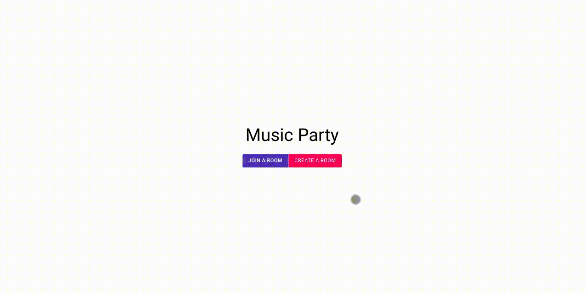

# Music Party

Easily collaborate in playing songs at a party!

## How?
1. Create a room & set the permissions.
2. Share the room code.
3. Play songs and let others vote to play/pause & skip!

## Demo
#### Create a Room

#### Join a Room

## Run locally

#### Spotify API access

1. Create a developer profile, and a new app on Spotify by going to [Spotify Developer Dashbboard](https://developer.spotify.com/dashboard/applications). 
2. In the app settings, set Redirect URI as `http://localhost:8000/`.
3. Copy the `CLIENT_ID` & `CLIENT_SECRET`, & paste it in the file `/path/to/repo/spotify/credentials.py`  file.

#### Backend 
 

     $ cd path/to/repo/
     $ pip install -r requirements.txt   
     $ python manage.py migrate
     $ python manage.py runserver
        
#### Frontend
 

    $ cd path/to/repo/frontend/
    $ npm install
    $ npm run dev

Now the app is live at `http://localhost:8000/`

### Enjoy! 🎊

